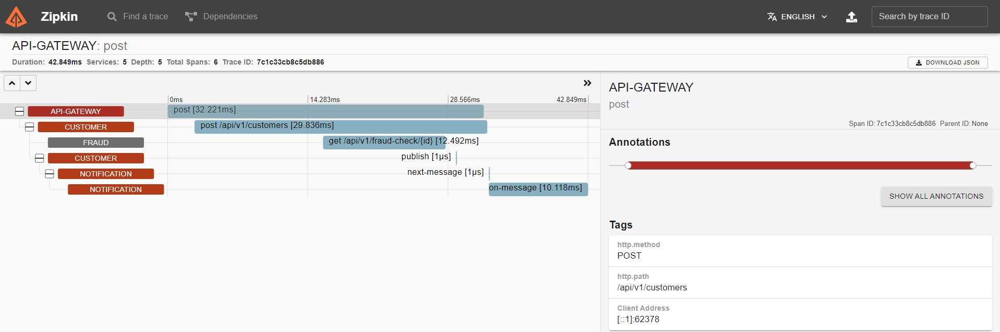

# Microservices-and-Distributed-Systems

A spring boot project created to learn microservices architecture
using modules within a single repository. The full diagram of the project
can be found bellow.

## Technologies
- Java 17
- Spring Boot
- PostgreSQL
- RabbitMQ
- Docker
- Docker compose
- Spring Cloud OpenFeign
- Zipkin
- Sleuth
- Eureka Server
- API Gateway

## Zipkin Tracing

